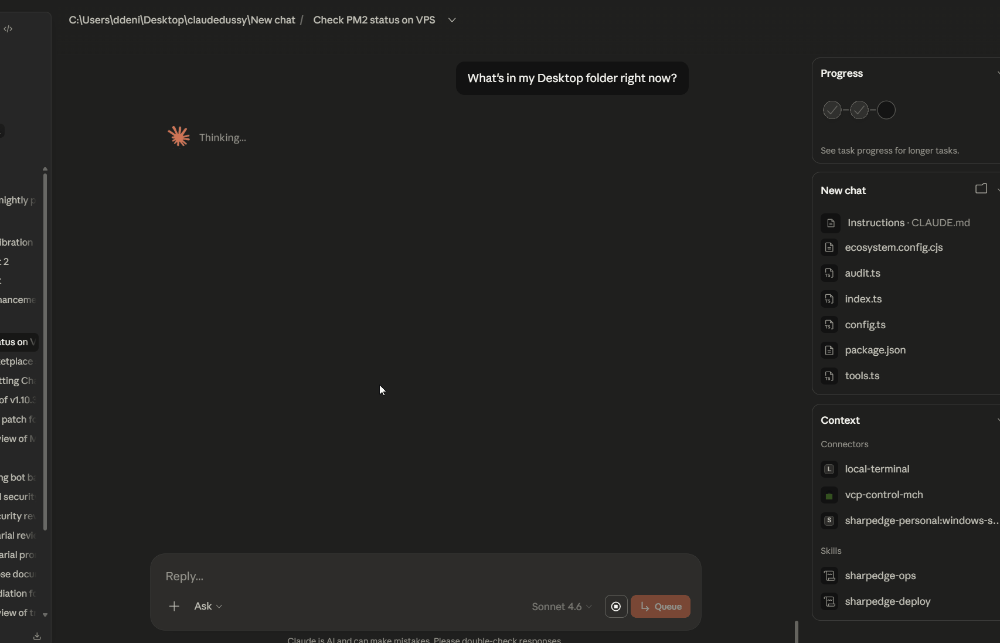
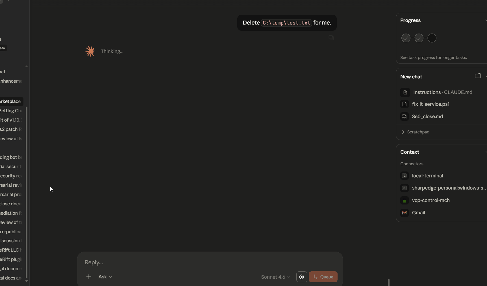

# local-terminal-mcp

Give Claude controlled access to your local Windows machine — browse files, read code, run approved commands, and manage projects without leaving your AI workflow.

Installed as a Claude Desktop extension. Lifecycle managed by Claude Desktop — no terminal, no service install, no config files. All commands pass through a three-tier security model (RED/AMBER/GREEN). Destructive patterns are hard-blocked server-side. Every call is audit-logged.

---

## What it does

Claude gets eight tools across three safety tiers:

**GREEN Tier — Read-only (always safe)**
- `list_directory` — list files and folders
- `read_file` — read up to 500 lines of any text file (sensitive files blocked)
- `get_system_info` — OS version, disk space, memory, running processes
- `find_files` — search for files by name pattern
- `search_file` — grep/findstr for text patterns in files

**GREEN Tier — Approved commands**
- `run_npm_command` — `install`, `ci`, `list`, and `run <script>` only
- `run_git_command` — read-only git: `status`, `log`, `diff`, `branch`, `fetch`

**Escape Hatch (RED/AMBER checked)**
- `run_command` — arbitrary shell command. `dry_run=true` by default. Passes through RED → AMBER → GREEN pipeline before execution.

---

## Three-Tier Security Model

### RED — Hard-Blocked (140+ patterns, 27 categories)

Commands that are permanently blocked regardless of context. Returns structured error with category, reason, and Terms of Service warning.

See [COMMANDS.md](COMMANDS.md) for the full category breakdown.

Examples: `rm`, `del`, `format`, `shutdown`, `taskkill`, `reg delete`, `curl`, `wget`, `Invoke-Expression`, `runas`, `schtasks`, `sc create`, `netsh`, `choco install`.

### AMBER — Warning-Required

Moderately risky commands with legitimate use cases. Forces `dry_run=true` with a warning. Must re-call with `dry_run=false` to execute.

Examples: `find -exec`, `xargs`, `robocopy`, `xcopy`, `move`, wildcard `rename`.

### GREEN — Allowed with Audit

All structured tools and any `run_command` that passes RED + AMBER checks.

---

## Sensitive File Protection

Even read-only tools block access to credential and secret files:

`.env`, SSH keys, `.pem`/`.key`/`.pfx`, Windows credential stores (`SAM`, `SECURITY`, `\Microsoft\Credentials`), cloud credentials (`.aws/`, `.gcloud/`, `.azure/`), browser login data, `kubeconfig`, `NTUSER.DAT`, `secrets.json`, `.git-credentials`, and more.

---

## Infrastructure Hardening

| Feature | Details |
|---|---|
| **Request timeout** | 30s hard kill on all commands |
| **Audit log rotation** | 10MB max, one `.old` backup (configurable via `AUDIT_MAX_SIZE_MB`) |
| **Secret redaction** | Tokens, keys, passwords auto-stripped from audit logs |
| **In-process only** | Runs as a stdio extension inside Claude Desktop — no network port opened |

---

## Requirements

- Windows 10 / 11
- Claude Desktop

---

## Install

Subscribe at [forgerift.io](https://forgerift.io) — you'll receive a `local-terminal.mcpb` file and a license key by email.

In Claude Desktop, open **Settings → Extensions → Install Extension** and select the `.mcpb` file. Enter your license key when prompted (and an Anthropic API key if you have one — optional, enables AI-assisted AMBER-tier review).

See [GETTING_STARTED.md](GETTING_STARTED.md) for the step-by-step walkthrough.

---

## Update / Uninstall

Updates and removal are handled by Claude Desktop's Extensions settings — no terminal commands needed.

---

## Configuration

Extension configuration is entered via Claude Desktop's user_config prompt when you install or reinstall the extension:

| Key | Required | Description |
|---|---|---|
| `lt_license_key` | Yes | License key from your ForgeRift email |
| `anthropic_api_key` | No | Enables AI-assisted review of AMBER-tier commands before execution |

---

## Logs

The audit log (`audit.log`) is written to the `logs/` subfolder within the extension's install directory, managed by Claude Desktop. Every tool call is recorded with tier, blocked status, and args (secrets auto-redacted).

---

## Pricing

- **Individual:** $14.99/mo or $149/yr — [forgerift.io/#pricing](https://forgerift.io/#pricing)
- **Bundle (local-terminal-mcp + vps-control-mcp):** $19.99/mo or $199/yr
- **Founder Cohort:** $9.99/mo individual / $14.99/mo bundle, locked for life, monthly billing only — eligibility window closes after the first 100 subscribers or 3 months post-launch (whichever comes first)
- **14-day free trial** — no charge during trial period; no refunds after trial ends

## License

Released under the [MIT License](LICENSE).

## Documentation

- **[GETTING_STARTED.md](GETTING_STARTED.md)** — Step-by-step setup guide for new users
- **[CLAUDE_CONTEXT.md](CLAUDE_CONTEXT.md)** — Load into Claude for expert plugin assistance and self-diagnosis
- **[COMMANDS.md](COMMANDS.md)** — Plain-English breakdown of all GREEN/AMBER/RED command categories
- **[TROUBLESHOOTING.md](TROUBLESHOOTING.md)** — Common issues and fixes
- **[SECURITY.md](SECURITY.md)** — Full security model and configuration reference

## Support

- **Issues:** [GitHub Issues](https://github.com/ForgeRift/local-terminal-mcp/issues)
- **Security:** Report vulnerabilities to security@forgerift.io
- **General:** support@forgerift.io

---

**Built by ForgeRift LLC** | [forgerift.io](https://forgerift.io)
