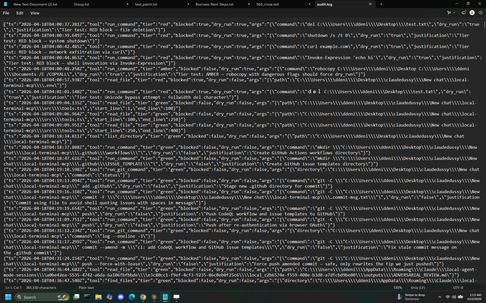

# local-terminal-mcp

[](https://github.com/ForgeRift/local-terminal-mcp)
[](LICENSE)
[](SECURITY.md)

Give Claude controlled access to your local Windows machine — browse files, read code, run approved commands, and manage projects without leaving your AI workflow.

Runs as a Windows Service so Claude stays connected across sessions. All commands pass through a three-tier security model (RED/AMBER/GREEN). Destructive patterns are hard-blocked server-side. Every call is audit-logged.


---

## What it does

Claude gets eight tools across three safety tiers:

**GREEN Tier — Read-only (always safe)**
- `list_directory` — list files and folders
- `read_file` — read up to 500 lines of any text file (sensitive files blocked)
- `get_system_info` — OS version, disk space, memory, running processes
- `find_files` — search for files by name pattern
- `search_file` — grep/findstr for text patterns in files

**GREEN Tier — Approved commands**
- `run_npm_command` — `install`, `ci`, `list`, and `run <script>` only
- `run_git_command` — read-only git: `status`, `log`, `diff`, `branch`, `fetch`

**Escape Hatch (RED/AMBER checked)**
- `run_command` — arbitrary shell command. `dry_run=true` by default. Passes through RED → AMBER → GREEN pipeline before execution.


---

## Three-Tier Security Model

### RED — Hard-Blocked (450+ patterns, 27 categories)

Commands that are permanently blocked regardless of context. Returns structured error with category, reason, and Terms of Service warning.

**Categories:** file-delete, disk-ops, system-state, process-kill, user-mgmt, permissions, network-config, scheduled-exec, service-mgmt, code-exec, data-exfil, persistence, direct-db, pkg-install, pkg-remove, container, file-write, env-manip, priv-esc, info-leak, chaining, http-server.

Examples: `rm`, `del`, `format`, `shutdown`, `taskkill`, `reg delete`, `curl`, `wget`, `Invoke-Expression`, `runas`, `schtasks`, `sc create`, `netsh`, `choco install`.

### AMBER — Warning-Required

Moderately risky commands with legitimate use cases. Forces `dry_run=true` with a warning. Must re-call with `dry_run=false` to execute.

Examples: `find -exec`, `xargs`, `robocopy`, `xcopy`, `move`, wildcard `rename`.

### GREEN — Allowed with Audit

All structured tools and any `run_command` that passes RED + AMBER checks.


---

## Sensitive File Protection

Even read-only tools block access to credential and secret files:

`.env`, SSH keys, `.pem`/`.key`/`.pfx`, Windows credential stores (`SAM`, `SECURITY`, `\Microsoft\Credentials`), cloud credentials (`.aws/`, `.gcloud/`, `.azure/`), browser login data, `kubeconfig`, `NTUSER.DAT`, `secrets.json`, `.git-credentials`, and more.

---

## Infrastructure Hardening

| Feature | Details |
|---|---|
| **Rate limiting** | 120 req/min per token (configurable via `RATE_LIMIT_PER_MIN`) |
| **Request timeout** | 30s hard kill on all commands |
| **Audit log rotation** | 10MB max, one `.old` backup (configurable via `AUDIT_MAX_SIZE_MB`) |
| **CORS** | Permissive headers for Cowork/Desktop integration |
| **Secret redaction** | Tokens, keys, passwords auto-stripped from audit logs |
| **Localhost-only** | Binds to `127.0.0.1` — not reachable from network |

---

## Requirements

- Windows 10 / 11
- [Node.js](https://nodejs.org) v18 or later
- PowerShell (run as Administrator for setup)

---

## Installation

```powershell
# 1. Clone or download the repo
git clone https://github.com/ForgeRift/local-terminal-mcp
cd local-terminal-mcp

# 2. Run the installer as Administrator
.\setup.ps1
```

`setup.ps1` will:
- Build the project
- Generate a random auth token and save it to `.env`
- Download NSSM and install `local-terminal-mcp` as a Windows Service
- Configure auto-restart on crash (3s delay)
- Print the `claude_desktop_config.json` snippet to paste

Add the printed snippet to your Claude Desktop config, then restart Claude Desktop.

**Config file location:**
```
%LOCALAPPDATA%\Packages\Claude_pzs8sxrjxfjjc\LocalCache\Roaming\Claude\claude_desktop_config.json
```

---

## Updating

```powershell
git pull
.\setup.ps1
```

Re-running `setup.ps1` stops and removes the existing service, installs the new version, and restarts — your `.env` (auth token) is preserved.

---

## Uninstalling

```powershell
.\uninstall.ps1
```

Stops and removes the service, prompts before deleting the install directory, and reminds you to clean up `claude_desktop_config.json`.

---

## Configuration

All settings live in `.env` (auto-generated by `setup.ps1`):

| Variable | Default | Description |
|---|---|---|
| `MCP_AUTH_TOKEN` | auto-generated | Bearer token required on every request |
| `MCP_PORT` | `3002` | Local port (localhost-only) |
| `MCP_LOG_DIR` | `./logs` | Directory for service stdout/stderr logs |
| `RATE_LIMIT_PER_MIN` | `120` | Max requests per minute per token |
| `AUDIT_MAX_SIZE_MB` | `10` | Audit log max size before rotation |
| `ANTHROPIC_API_KEY` | — | Required for Layer 2/3 AI classification (Haiku + Sonnet safety board) |
| `BYPASS_BINARIES` | — | Comma-separated process names exempt from RED-tier blocking (logged as `[SECURITY-BYPASS]`) |
| `LAYER3_MODEL` | claude-sonnet-4-5 | Model used for Layer 3 safety board classification |
| `LAYER_STRICT_MODE` | false | If true, Layer 2/3 failures block rather than pass-through |

---

## Logs

| File | Contents |
|---|---|
| `logs/service-out.log` | stdout from the Node process |
| `logs/service-err.log` | stderr from the Node process |
| `logs/audit.log` | every tool call with tier, blocked status, and args |



---

## Pricing

- **Individual:** $14.99/mo or $149/yr — [forgerift.io/#pricing](https://forgerift.io/#pricing)
- **Bundle (local-terminal-mcp + vps-control-mcp):** $19.99/mo or $199/yr
- **Founder Cohort:** $9.99/mo locked for the first 100 subscribers or 3 months post-marketplace approval (whichever comes first)
- **14-day free trial** — no charge during trial period; no refunds after trial ends

## License

Source available under the [Business Source License 1.1](LICENSE) (BUSL 1.1). Converts to MIT four years after each version's release date.

## Documentation

- **[GETTING_STARTED.md](GETTING_STARTED.md)** — Step-by-step setup guide for new users
- **[CLAUDE_CONTEXT.md](CLAUDE_CONTEXT.md)** — Load into Claude for expert plugin assistance and self-diagnosis
- **[COMMANDS.md](COMMANDS.md)** — Plain-English breakdown of all GREEN/AMBER/RED command categories
- **[TROUBLESHOOTING.md](TROUBLESHOOTING.md)** — Common issues and fixes
- **[SECURITY.md](SECURITY.md)** — Full security model and configuration reference

## Support

- **Issues:** [GitHub Issues](https://github.com/ForgeRift/local-terminal-mcp/issues)
- **Security:** Report vulnerabilities to security@forgerift.io
- **General:** support@forgerift.io

---

**Built by ForgeRift LLC** | [forgerift.io](https://forgerift.io)
